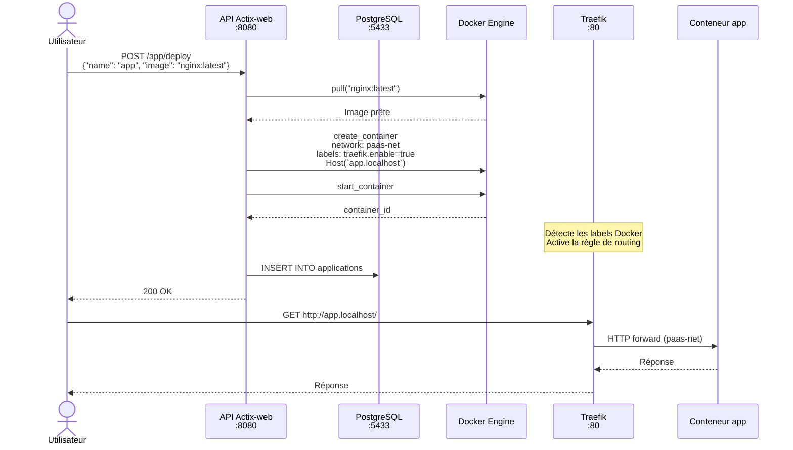
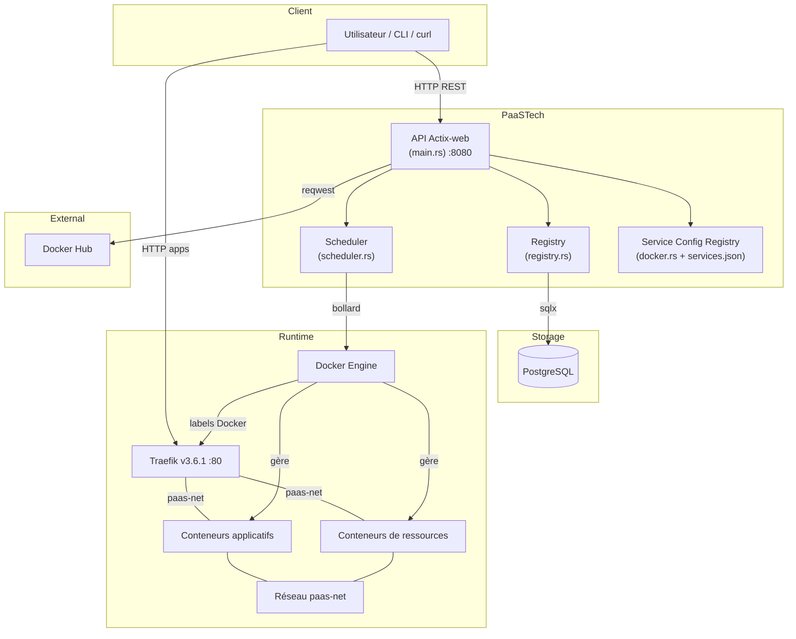
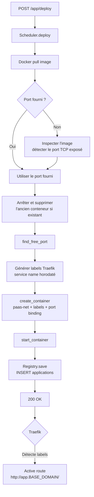

# Vue d'ensemble de l'architecture

PaaSTech est structurée autour de trois couches : une **API REST** pour exposer les opérations, un **moteur d'orchestration** pour interagir avec Docker, et une **couche de persistance** PostgreSQL pour l'état de la plateforme. Traefik assure le routing HTTP vers les applications déployées.

---

## Flux d'une requête de déploiement



---

## Schéma des composants



---

## Rôle de chaque composant

### API (`main.rs`)

Point d'entrée unique. Reçoit les requêtes HTTP, orchestre les appels aux autres modules, retourne les réponses JSON. Expose une interface Swagger UI.

### Scheduler (`scheduler.rs`)

Couche d'abstraction sur Docker via [bollard](https://github.com/fussybeaver/bollard). Responsable de : pull d'images, génération des labels Traefik, création/démarrage/arrêt des conteneurs sur le réseau `paas-net`, inspection d'état, surveillance et auto-restart.

### Traefik

Reverse proxy HTTP en écoute sur le port 80 (production) ou 8081 (développement). Il surveille les labels Docker des conteneurs sur le réseau `paas-net` et configure dynamiquement les règles de routing. Chaque application est exposée sous `http://{nom-app}.{BASE_DOMAIN}/`.

### Registry (`registry.rs`)

Couche d'accès aux données pour les **applications**. Encapsule les requêtes SQL sur la table `applications` via [sqlx](https://github.com/launchbadge/sqlx).

### Service Config Registry (`docker.rs`)

Registre statique des services supportés, chargé depuis `services/services.json`. Fournit les images Docker, ports par défaut, variables d'environnement et fichiers de configuration pour chaque type de service.

---

## Flux de déploiement détaillé



---

## Persistance de l'état

Toutes les décisions d'orchestration sont persistées dans PostgreSQL :

| Table | Contenu |
|---|---|
| `applications` | Nom, image, container_id, port, statut |
| `services` | Nom, version, container_id, port, statut |
| `application_services` | Associations application ↔ ressource |
| `service_env_vars` | Variables d'environnement des ressources |

En cas de redémarrage de l'API, l'état est restauré depuis la base. Les conteneurs Docker qui tournaient avant le redémarrage continuent de tourner et Traefik maintient ses routes tant que les conteneurs sont actifs.

---

## Accès réseau aux applications

```
Utilisateur ──HTTP──→ Traefik :80 ──[paas-net]──→ Conteneur :{port_interne}
                      (Host: app.BASE_DOMAIN)
```

L'accès direct via port hôte reste possible pour les protocoles non-HTTP :

```
Utilisateur ──TCP──→ hôte:{port_hôte} ──→ Conteneur:{port_interne}
```
