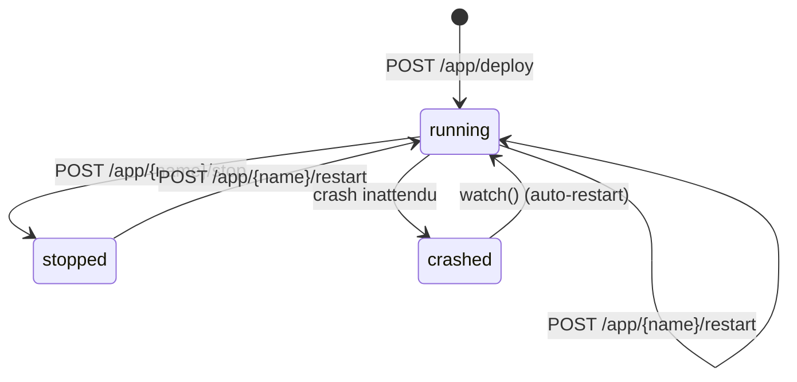

# Instances

Dans PaaSTech, une **instance** désigne le conteneur Docker en cours d'exécution associé à une application. Chaque application déployée via `POST /app/deploy` possède exactement une instance.

---

## Cycle de vie d'une instance



---

## Déployer une instance depuis une image Docker

Le déploiement crée l'instance et la démarre immédiatement.

```bash
curl -X POST http://localhost:8080/app/deploy \
  -H "Content-Type: application/json" \
  -d '{
    "name": "api-service",
    "image": "mon-image:1.2.3",
    "port": 3000
  }'
```

En interne, PaaSTech :

1. Pull l'image Docker Hub via l'API bollard
2. Inspecte l'image pour détecter le port exposé si `port` est omis
3. Arrête et supprime le conteneur précédent s'il existe (même nom)
4. Trouve un port hôte libre (TCP, lié dynamiquement)
5. Génère les labels Traefik pour le routing HTTP
6. Crée le conteneur sur le réseau `paas-net` avec les labels et le mapping de port
7. Démarre le conteneur
8. Enregistre l'application en base avec le statut `running`

Traefik détecte automatiquement les nouveaux labels et active la règle de routing HTTP vers l'instance.

---

## Accès à l'instance via Traefik

Chaque instance est accessible via Traefik sous `http://{nom-application}.{BASE_DOMAIN}/`.

Le label généré automatiquement par PaaSTech :

```
traefik.http.routers.api-service.rule=Host(`api-service.localhost`)
```

Pour tester depuis l'hôte de développement :

```bash
curl -H "Host: api-service.localhost" http://localhost:8081/
```

L'instance est aussi accessible directement via le port hôte alloué (visible dans `GET /app`).

---

## Arrêter une instance

```bash
curl -X POST http://localhost:8080/app/api-service/stop
```

L'instance est arrêtée (`docker stop`) et supprimée. Le statut passe à `stopped` en base. Traefik retire immédiatement la règle de routing HTTP.

---

## Redémarrer une instance

```bash
curl -X POST http://localhost:8080/app/api-service/restart
```

Cette opération effectue un **redéploiement complet** :

1. Pull de la même image
2. Arrêt du conteneur existant
3. Suppression du conteneur
4. Recréation avec de nouveaux labels Traefik (service name horodaté)
5. Démarrage

Voir [Rolling Update](rolling-update.md) pour les détails de la mécanique.

---

## Consulter l'état en temps réel

```bash
curl http://localhost:8080/app/api-service/status
```

L'endpoint interroge Docker directement (via bollard) et retourne l'état réel du conteneur : `running`, `exited`, `paused`, ou `unknown`.

La valeur du champ `status` dans `GET /app` reflète le dernier état connu enregistré en base, qui peut différer de l'état Docker réel si le conteneur s'est arrêté de manière inattendue.

---

## Comportement en cas de crash

Le module `scheduler::watch()` surveille les conteneurs toutes les 5 secondes. Lorsqu'un conteneur applicatif est détecté en état `exited`, il est automatiquement redémarré et le statut en base est mis à jour.

---

## Configuration réseau des instances

Chaque instance est connectée au réseau Docker `paas-net` et reçoit un **port hôte alloué dynamiquement**. Le trafic HTTP passe par Traefik, qui route selon le `Host` header.

```
Requête HTTP → Traefik :80 ──[paas-net]──→ Conteneur:{port_interne}
```

L'accès direct via port hôte reste possible (utile pour les protocoles non-HTTP) :

```bash
# Récupérer le port alloué
curl http://localhost:8080/app | python3 -c "
import sys, json
apps = json.load(sys.stdin)
for app in apps:
    print(f\"{app['name']}: http://localhost:{app['port']}\")
"
```
