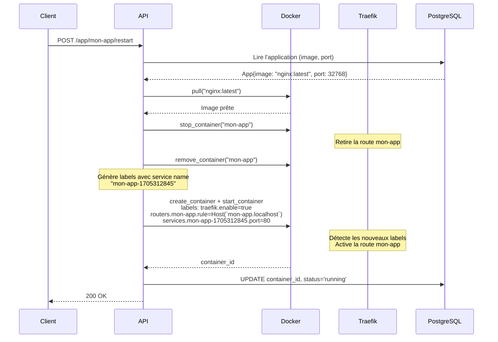

# Rolling Update

Cette page décrit la mécanique de redéploiement d'une application dans PaaSTech et le rôle de Traefik dans la transition.

---

## Déclencher un redéploiement

```
POST /app/{app_name}/restart
```

```bash
curl -X POST http://localhost:8080/app/mon-app/restart
```

Réponse : `200 OK` (corps vide).

---

## Ce qui se passe en interne

Le handler `restart_app` invoque `scheduler::redeploy()`. La particularité du mécanisme est l'utilisation d'un **nom de service Traefik horodaté** : chaque redéploiement génère un nouveau nom de service unique (`{app_name}-{unix_timestamp}`), ce qui évite les conflits de configuration dans Traefik entre l'ancienne et la nouvelle instance.



---

## Labels Traefik générés par PaaSTech

Pour chaque déploiement, PaaSTech génère automatiquement les labels Docker suivants :

```
traefik.enable=true
traefik.http.routers.{app_name}.rule=Host(`{app_name}.{BASE_DOMAIN}`)
traefik.http.routers.{app_name}.service={app_name}-{timestamp}
traefik.http.services.{app_name}-{timestamp}.loadbalancer.server.port={internal_port}
```

Le **nom du routeur** (`routers.{app_name}`) reste constant entre les redéploiements, ce qui maintient la même URL d'accès. Le **nom du service** (`services.{app_name}-{timestamp}`) change à chaque déploiement pour éviter les conflits Traefik.

---

## Étapes détaillées

1. **Lecture en base** — L'API récupère l'image Docker et le port hôte de l'application existante.

2. **Pull de l'image** — L'image est retirée depuis Docker Hub. Si le tag est `latest`, Docker vérifie si une version plus récente est disponible.

3. **Arrêt et suppression du conteneur** — Le conteneur existant est arrêté puis supprimé. Traefik retire immédiatement la règle de routing, les connexions actives sont coupées.

4. **Génération des nouveaux labels** — Un nouveau service name horodaté est créé pour éviter tout conflit de configuration Traefik.

5. **Recréation** — Un nouveau conteneur est créé sur `paas-net` avec les nouveaux labels et le même port hôte.

6. **Démarrage** — Le conteneur démarre. Traefik détecte les labels et active la règle de routing HTTP.

7. **Mise à jour en base** — Le nouvel ID de conteneur est persisté.

---

## Réutilisation du port hôte

Le port hôte alloué lors du déploiement initial est réutilisé lors du redéploiement. Cela garantit que l'accès direct (sans Traefik) reste sur le même port.

---

## Redéploiement avec `latest`

Si l'image est taguée `latest`, Docker pull récupère la version la plus récente disponible sur Docker Hub lors du redéploiement.

```bash
# Déployer avec latest
curl -X POST http://localhost:8080/app/deploy \
  -H "Content-Type: application/json" \
  -d '{"name": "mon-app", "image": "mon-app:latest", "port": 3000}'

# Mettre à jour (pull la dernière version de latest)
curl -X POST http://localhost:8080/app/mon-app/restart
```

---

## Détection automatique du port exposé

Si le champ `port` est omis lors du déploiement initial, PaaSTech inspecte l'image Docker pour détecter le port TCP exposé. Si l'image expose exactement un port TCP, il est utilisé automatiquement. Si elle en expose plusieurs, la requête retourne une erreur avec la liste des ports disponibles.

```bash
# Déploiement sans port explicite (détection automatique)
curl -X POST http://localhost:8080/app/deploy \
  -H "Content-Type: application/json" \
  -d '{"name": "mon-app", "image": "nginx:latest"}'
# nginx expose uniquement 80/tcp — détecté automatiquement
```
